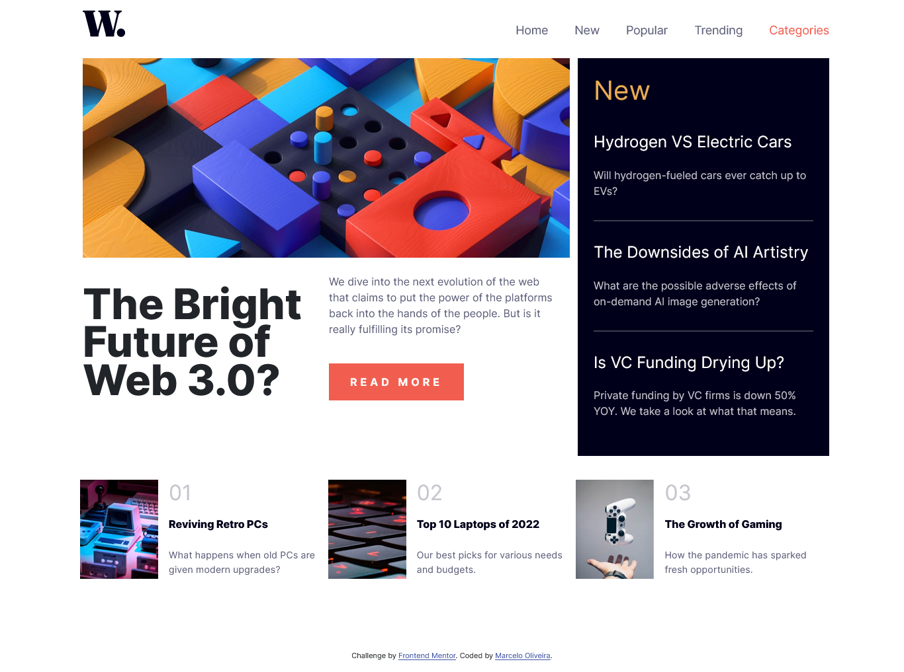

# Frontend Mentor - News homepage solution

This is a solution to the [News homepage challenge on Frontend Mentor](https://www.frontendmentor.io/challenges/news-homepage-H6SWTa1MFl). Frontend Mentor challenges help you improve your coding skills by building realistic projects.

## Table of contents

- [Overview](#overview)
  - [The challenge](#the-challenge)
  - [Screenshot](#screenshot)
  - [Links](#links)
- [My process](#my-process)
  - [Built with](#built-with)
- [Author](#author)

## Overview

### The challenge

Users are able to:

- View the optimal layout for the interface depending on their device's screen size
- See hover and focus states for all interactive elements on the page
- **Bonus**: Toggle the mobile menu (requires some JavaScript)

### Screenshot

### Links

- Solution URL: [Here](https://www.frontendmentor.io/solutions/responsive-news-page-with-a-dash-of-bootstrap-zMJXm4hnw_)
- Live Site URL: [Here](https://heiderick13.github.io/news-page/)

## My process

### Built with

- Semantic HTML5 markup
- Mobile-first workflow
- CSS
- [Boostrap ](https://getbootstrap.com/) - CSS library
- Vanilla JavaScript

## Author

- Github - [@heiderick13](https://github.com/heiderick13)
- Frontend Mentor - [@heiderick13](https://www.frontendmentor.io/profile/heiderick13)
- LinkedIn - [Marcelo Oliveira](https://www.linkedin.com/in/marcelo-ferreira-de-oliveira/)
